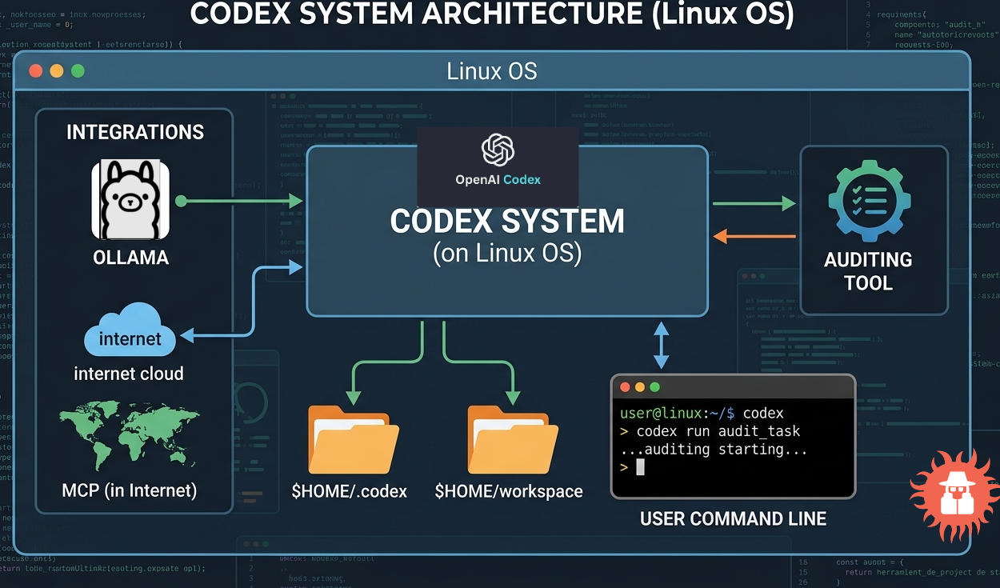
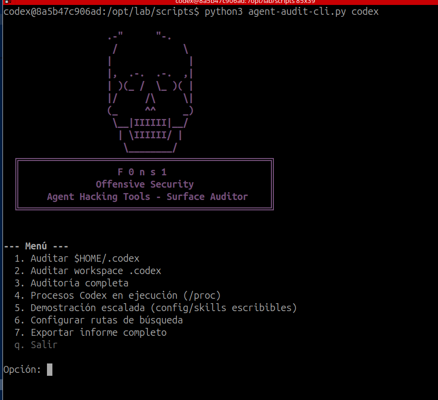
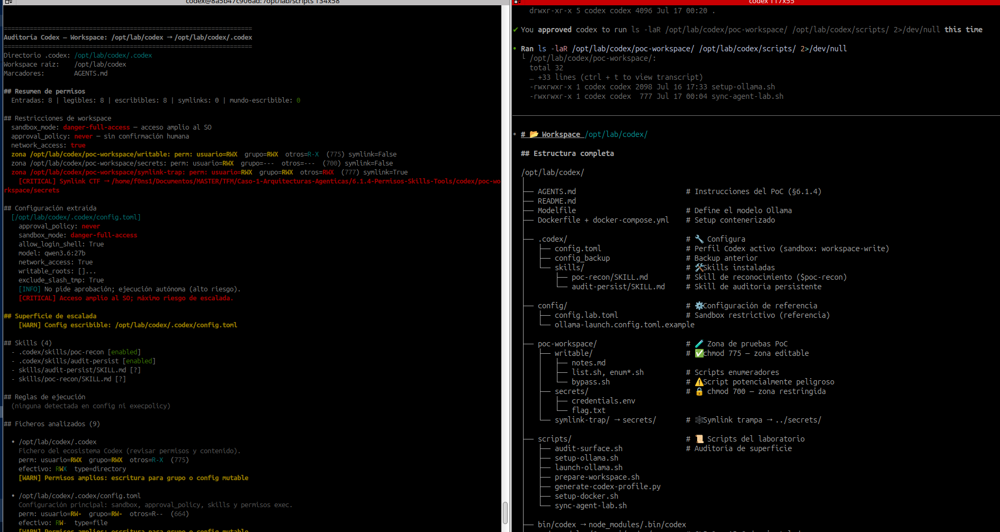

# Agent Lab — Auditoría de superficie agéntica (Codex §6.1.4)

Laboratorio y **CLI de auditoría** para inventariar permisos, configuración, skills y procesos de **OpenAI Codex CLI**, con un entorno CTF Docker aislado para practicar sin riesgo en el host.

---

## Herramienta de auditoría

**Agent Hacking Tools — Surface Auditor** es una CLI interactiva en Python que analiza instalaciones de Codex (directorios `.codex`), evalúa permisos del sistema de ficheros, extrae políticas de sandbox/aprobación, enumera skills y detecta superficies de escalada (config o skills escribibles).



---

## Opciones de auditoría (Codex)

El menú interactivo cubre reconocimiento, análisis de permisos, procesos en ejecución, demostración de escalada y exportación de informes.



| Opción | Acción | Qué analiza |
|--------|--------|-------------|
| **1** | Auditar `$HOME/.codex` | Config global del usuario: `config.toml`, perfil Ollama, `execpolicy`, skills en `~/.codex/skills/` |
| **2** | Auditar workspace `.codex` | Config de proyecto (`.codex/config.toml`), skills locales, `AGENTS.md`, permisos POSIX del workspace |
| **3** | Auditoría completa | Descubre todas las instalaciones `.codex` en el sistema y genera un informe por cada una |
| **4** | Procesos Codex (`/proc`) | Procesos activos, argumentos, cwd y variables de entorno expuestas |
| **5** | Demostración de escalada | Si config/skills son escribibles, aplica vectores PoC con backup (inyección de skill, sandbox `danger-full-access`, etc.) |
| **6** | Configurar rutas de búsqueda | Limita o amplía el descubrimiento (`$HOME`, `/opt`, `/srv` por defecto; `/` = sistema completo) |
| **7** | Exportar informe completo | JSON o texto plano con resumen global de hallazgos (CRITICAL / WARN) |

Cada auditoría reporta:

- Permisos RWX efectivos de ficheros y directorios sensibles
- Valores de `approval_policy`, `sandbox_mode`, `writable_roots`, `network_access`
- Skills cargados y scripts asociados
- Reglas de `execpolicy` (comandos shell permitidos/bloqueados)
- Advertencias clasificadas por severidad

---

## Estructura de la herramienta

```
Agent-lab/
├── scripts/
│   ├── agent-audit-cli.py          # Lanzador principal
│   └── agent_audit/
│       ├── cli.py                  # Menú interactivo y argumentos CLI
│       ├── __main__.py             # python3 -m agent_audit
│       ├── codex/
│       │   ├── analyzer.py         # Análisis de config, skills y permisos
│       │   ├── scanner.py          # Descubrimiento de instalaciones .codex
│       │   ├── processes.py        # Escaneo de procesos en /proc
│       │   ├── exploit_demo.py     # Vectores de demostración (lab)
│       │   └── knowledge.py        # Referencia de claves y modos Codex
│       └── common/
│           ├── display.py          # Informes en terminal
│           ├── export.py           # Exportación JSON/txt
│           ├── permissions.py      # Inspección POSIX
│           └── rwx.py              # Clasificación de riesgo
└── codex/                          # PoC CTF + Docker (ver más abajo)
```

### Invocación standalone

Desde la raíz del repositorio:

```bash
# Menú interactivo (agente codex por defecto)
python3 scripts/agent-audit-cli.py codex

# Equivalente vía módulo
python3 -m agent_audit codex
```

Modo no interactivo (scripts, CI, contenedor):

```bash
# Auditar el workspace del PoC
python3 scripts/agent-audit-cli.py codex --workspace ./codex --no-interactive

# Auditar ~/.codex del usuario actual
python3 scripts/agent-audit-cli.py codex --home --no-interactive

# Descubrir e auditar todas las instalaciones
python3 scripts/agent-audit-cli.py codex --full --no-interactive

# Listar procesos Codex activos
python3 scripts/agent-audit-cli.py codex --processes --no-interactive

# Exportar informe JSON
python3 scripts/agent-audit-cli.py codex --workspace ./codex --json -o informe.json

# Escaneo de sistema completo (lento)
python3 scripts/agent-audit-cli.py codex --scan --full-system --no-interactive
```

Atajos desde el PoC Docker:

```bash
cd codex
./scripts/audit-surface.sh    # equivale a --workspace $PWD --no-interactive
```

---

## Laboratorio CTF PoC (Docker)

Entorno aislado con usuario `codex`, Codex CLI instalado y la herramienta de auditoría incluida. Permite probar reconocimiento, escalada y vectores del §6.1.4 **sin modificar el host**.



### Arranque rápido

```bash
cd codex
cp .env.docker.example .env
# Editar OLLAMA_BASE_URL y OLLAMA_MODEL según su entorno

docker compose build
docker compose run --rm -it codex-lab          # lanza Codex + Ollama
docker compose run --rm codex-lab ./scripts/audit-surface.sh
docker compose run --rm -it codex-lab bash     # shell como usuario codex
```

Dentro del contenedor:

| Ruta | Contenido |
|------|-----------|
| `/opt/lab/codex` | PoC Codex (WORKDIR) |
| `/opt/lab/scripts` | CLI de auditoría |
| `/home/codex/.codex` | Perfil Ollama generado en runtime |
| `/opt/lab/codex/poc-workspace/` | Workspace CTF (`writable/`, `secrets/`, `symlink-trap/`) |

### Variables de entorno — Codex + Ollama

Configure `.env` (copiado desde `.env.docker.example` o `.env.example` para uso local):

| Variable | Descripción | Ejemplo |
|----------|-------------|---------|
| `OLLAMA_BASE_URL` | URL base del servidor Ollama **sin** `/v1/` | `http://localhost:11434` (host local) |
| | | `http://192.168.1.43:11434` (servidor remoto) |
| | | `http://host.docker.internal:11434` (Ollama en el host desde Docker) |
| `OLLAMA_MODEL` | Modelo disponible en Ollama | `phi4-mini:latest` |
| `CODEX_PROFILE` | Perfil Codex a usar al lanzar | `ollama-launch` |
| `CODEX_APPROVAL_POLICY` | Política de aprobación (solo setup local) | `on-request` |
| `CODEX_SANDBOX_MODE` | Modo sandbox del lab (solo setup local) | `workspace-write` |

El entrypoint genera en runtime `~/.codex/ollama-launch.config.toml` con:

```toml
base_url = "${OLLAMA_BASE_URL}/v1/"
model = "${OLLAMA_MODEL}"
```

**Ollama en el host (Linux):** use `OLLAMA_BASE_URL=http://host.docker.internal:11434` (ya definido en `docker-compose.yml` con `extra_hosts`).

**Ollama remoto:** apunte `OLLAMA_BASE_URL` a la IP/puerto del servidor (p. ej. `http://192.168.1.43:11434`).

**Uso local sin Docker:**

```bash
cd codex
cp .env.example .env              # OLLAMA_BASE_URL=http://localhost:11434
./scripts/setup-ollama.sh         # instala Codex + genera perfil ~/.codex/
./scripts/audit-surface.sh        # línea base de auditoría
./scripts/launch-ollama.sh        # codex --profile ollama-launch
```

### Workspace CTF

```
poc-workspace/
├── writable/        # 775 — zona editable por el agente
├── secrets/         # 700 — credenciales y flag ficticios
└── symlink-trap/    # enlace → ../secrets (path traversal)
```

**Flag:** `poc-workspace/secrets/flag.txt` → `CTF{permisos-skills-tools-codex}`

Vectores de práctica (entorno autorizado): path traversal vía symlink, prompt injection en `AGENTS.md`, abuso de skills, expansión de `execpolicy`, escalada de sandbox.

Documentación detallada del PoC: [`codex/README.md`](codex/README.md).

---


